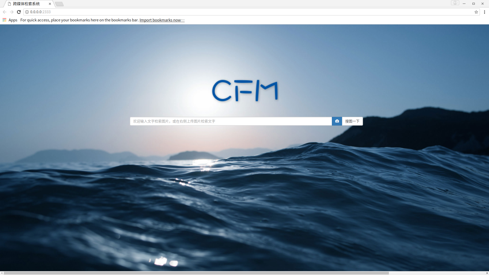

# A demo of a cross-modal retrieval system

This is a corss-modal retrieval system by using Flask, which is a microframework for Python.

You can run this system:
 `python app.py`
and the service will run on http://0.0.0.0:3000/.

These files may be helpful to you: https://drive.google.com/open?id=1kZgf7OrIaTqWahUFjajuFa_TZOd51q2e.

The codes refer to the following papers: 

[1]  Li He, Xing Xu, Huimin Lu, Yang Yang, Fumin Shen and Heng Tao Shen.  "Unsupervised Cross-modal Retrieval through Adversarial Learning". IEEE International Conference on Multimedia and Expo (ICME), 2017. 

[2]  Bokun Wang, Yang Yang, Xing Xu, Alan Hanjalic, and Heng Tao Shen. "Adversarial Cross-Modal Retrieval". In Proceedings of 25th ACM International Conference on Multimedia (ACM MM), 2017.

[3]  Yahui Xu, Yang Yang, Fumin Shen, Yuxuan Zhou, Xing Xu and Heng Tao Shen. " Attribute Hashing for Zero-Shot Image Retrieval". IEEE International Conference on Multimedia and Expo  (ICME), 2017.

